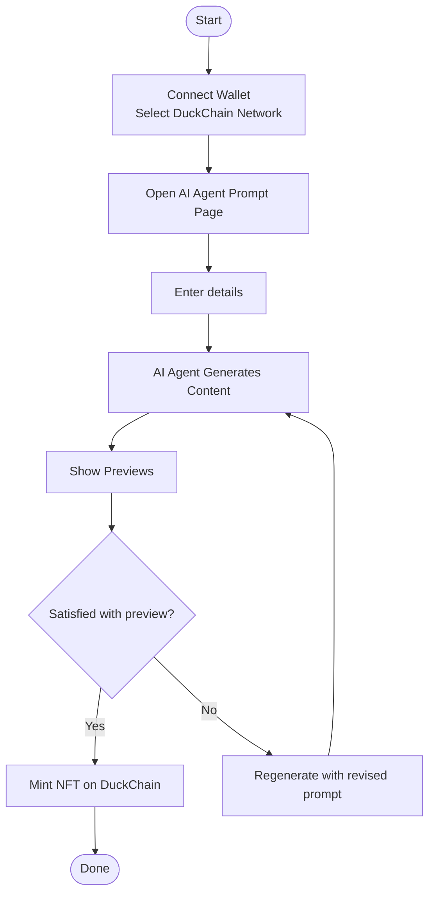
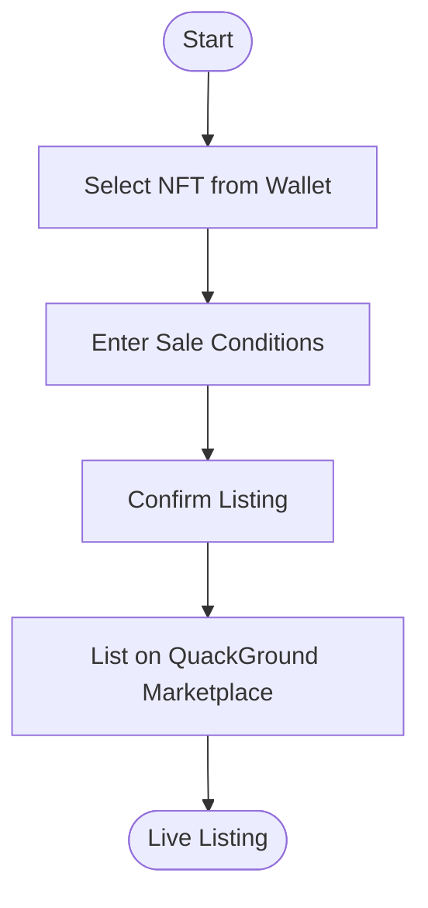
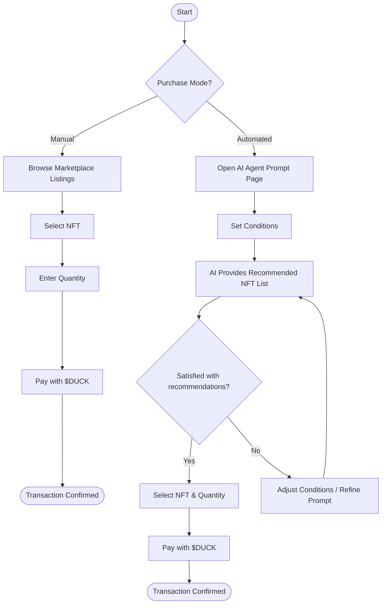

# QuackGround

#### [Demo]() | [Video]() | [Pitchdeck](https://www.figma.com/deck/UdBDq78PughN104FIJSfYA)

## Project Overview

QuackGround is a **decentralized marketplace that connects AI with creators**.
Users can collaborate with AI agents to generate artistic works (images, videos, etc.), mint them as **NFTs**, and trade them.
All transactions and activities are powered by the **DuckChain-based \$DUCK token**, fostering a **creative and autonomous ecosystem** led by the community.

QuackGround is not just an NFT marketplace.

> 👉 Through **AI-powered content creation, trend curation, and automated purchasing agents**, it establishes a new form of **creative production and consumption cycle**.

## Core Values

1. **AI-Driven Creation**
   Anyone can create art or video content by simply prompting an AI agent in natural language.

2. **Decentralized Marketplace (DuckChain)**
   NFTs minted on DuckChain can be freely traded, with all transactions recorded transparently on-chain.

3. **Curation & Recommendation**
   AI agents analyze the latest market trends to recommend NFTs → enabling both manual and automated purchases.

4. **Token Economy with \$DUCK**
   \$DUCK tokens are used across content creation, sales, purchases, and community participation.

## NFT Creation Flow

1. **Wallet Connection** → User connects wallet and selects DuckChain network.
2. **Prompt Input** → Enter details such as content type (image/video), network, quantity, style, and description.
3. **AI Agent Generation** → AI agent generates NFT content based on the inputs.
4. **Preview** → Generated previews are shown to the user.
5. **Minting Choice**
   * If satisfied → NFT is minted on DuckChain.
   * If not → Regenerate new previews.

## NFT Selling Flow

1. Select NFT to sell.
2. Enter sale conditions (price, quantity).
3. List the NFT on the QuackGround marketplace (DuckChain-based).

## NFT Purchasing Flow

### ① Manual Purchase

* Browse NFT marketplace listings.
* Select desired NFT.
* Enter quantity and pay with **\$DUCK tokens**.

### ② Automated Purchase (via AI Agent)
* Go to prompt page and set conditions (trends, preferred price range, etc.).
* AI provides a **recommended NFT list**.
* Select NFTs from the list, enter quantity → proceed with payment.

## Role of \$DUCK Token (DuckChain Native Token)
* **Payment**: Used for NFT purchases and platform services.
* **Rewards**: Incentives for creators and community contributors.
* **Governance**: DAO-based decision-making on DuckChain.

## Ecosystem Participants
* **Creators**: Use AI to generate and sell NFTs.
* **Collectors**: Purchase NFTs manually or through AI recommendations.
* **AI Agents**:
  * Content creation
  * Trend-based recommendations and curation
  * Automated trading support
* **Community**: Operates autonomously with DuckChain-based \$DUCK tokens.

## **Differentiation Points**

* Not just NFT trading — **AI supports real-time creation and curation**.
* **Automated purchase option** ensures investors/collectors never miss trends.
* **Open opportunities for creators** — accessible to both professional artists and casual users.
* **Strengthened token economy on DuckChain** — \$DUCK serves both utility and governance roles.

> 👉 In summary, **QuackGround is a new type of creative platform combining “AI + NFTs + DuckChain decentralized marketplace.”**
Users collaborate with AI to create, mint, and trade NFTs, while the **DuckChain-based \$DUCK token** powers rewards, governance, and value exchange across the ecosystem.